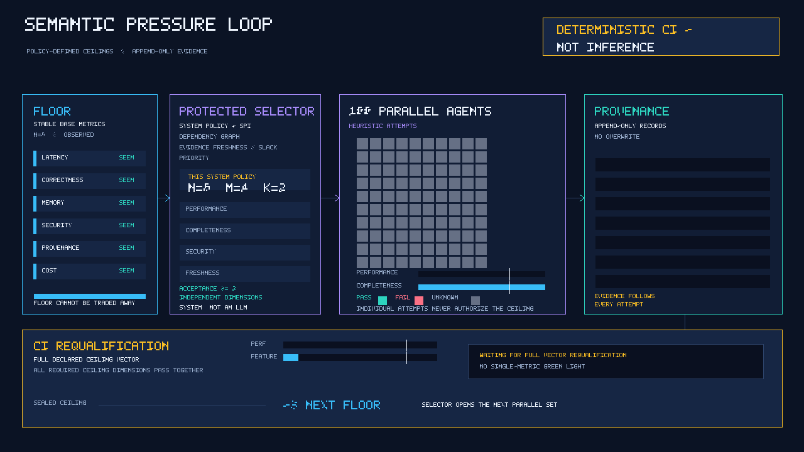

# meta-ontology-go

`meta-ontology-go` is an experimental semantic compiler implemented in Go. Its
surface files use the `.gooo` extension: **Go Of Ontology**.

The project has one deliberate authority boundary: `.gooo` declarations express
business intent. The compiler lowers that view to a normalized semantic IR and
projects structural boundaries to Go. Handwritten Go remains the source of truth
for irreducible implementation logic; generated Go, query output, documentation,
and CI results are derived views or evidence.

```text
.gooo intent ──lower──> semantic IR ──project──> generated Go
     │                         │                    │
     │                         └── facts/evidence   └── handwritten slots
     └── source spans, IDs, and explicit assertions
```

The repository is intentionally small. The supported language sketch currently
covers packages, namespaces, entities with URI-like IDs, and activities with
entity inputs and an entity result. The semantic kernel also defines a
PROV-inspired vocabulary, deterministic normalization, explicit candidate facts,
and marker-based generated regions. See [the architecture](docs/architecture.md)
and [the language sketch](docs/spec.md).

## The deterministic pressure loop

[](docs/assets/metric-pressure-loop/metric-pressure-loop.png)

The [static PNG preview](docs/assets/metric-pressure-loop/metric-pressure-loop.png)
is useful in viewers that do not animate GIFs. The loop is illustrative: each
system's protected policy/SPI declares its own `N` base metrics, `M` cross
pressures, and active `K`; the language guarantees at least **two independent,
non-compensating pressure dimensions**, not one universal set of numbers. The
animation uses `N=6`, `M=4`, and `K=2` only as one concrete policy instance, and
the 100 parallel agents are an illustrative workload. Agent attempts are
heuristic and may PASS, FAIL, or remain UNKNOWN; deterministic policy selection
and **Deterministic CI — not inference** perform the ceiling-vector
requalification, where all required dimensions must pass together before the
qualified ceiling becomes the next floor.

Regenerate and verify the checked-in media with:

```sh
go run ./docs/assets/metric-pressure-loop
go run ./docs/assets/metric-pressure-loop -check
```

## Quick start

Run the repository checks from the project root:

```sh
gofmt -l .
go test ./...
go vet ./...
go run ./cmd/gooo check examples/billing/main.gooo
```

The conformance walkthrough in [docs/conformance.md](docs/conformance.md) uses
the checked-in examples and shows the expected command shapes. It also calls out
which CLI surfaces are not yet supported. The current GitHub Actions workflow is
documented in [CONTRIBUTING.md](CONTRIBUTING.md); it should be treated as the
source of truth for required CI, not as a promise of future compiler features.

## Branch and promotion contract

Work branches target `dev`. The only promotion route is an exact,
same-repository `dev`-to-`main` pull request; no intermediary branch is part of
the current contract. Governance is `ci_only`: review and approval fields do not
authorize a protected-branch promotion.

The six canonical proof jobs are `gofmt`, `go vet`, `go test`, `go test -race`,
`Semantic conformance`, and `CI policy`. Protected `dev` requires those six plus
`CI guardian shadow`; protected `main` requires those six plus `CI guardian`.
The resulting seven-context protections are route-specific.

For the promotion route, CI emits a digest-bound `promotion_authorization` with
`source=dev`, `target=main`, and `operation=fast_forward`. It passes only for
fresh exact refs and topology (`ahead > 0`, `behind = 0`, `main` as merge base),
the required proof and Guardian evidence, both exact seven-context protection
snapshots, and a clean, open, non-draft, unmerged same-repository pull request.
The proof producer never mutates refs or protection. After a final exact reread,
only a normal CAS/fast-forward update is allowed; force updates are prohibited.

## Project status

This is an experimental language, not a stable application framework. In
particular, the repository does not currently promise a production LSP, a stable
`analyze` CLI, automatic promotion of ambiguous Go observations, or durable
provenance publishing. Internal packages and design notes may describe those
directions, but a feature is supported only when its command/API and conformance
evidence are present.

## Governance

[AGENTS.md](AGENTS.md) defines authority boundaries and agent roles.
[CONTRIBUTING.md](CONTRIBUTING.md) defines branch, PR, review, and CI workflow.
[docs/governance.md](docs/governance.md) records the SSOT boundary, BX laws, line
caps, and evidence policy. [docs/metrics-rfc.md](docs/metrics-rfc.md) defines
the design-only deterministic metric contract. [docs/conformance.md](docs/conformance.md)
is the runnable example index.

[W3C PROV-O]: https://www.w3.org/TR/prov-o/
