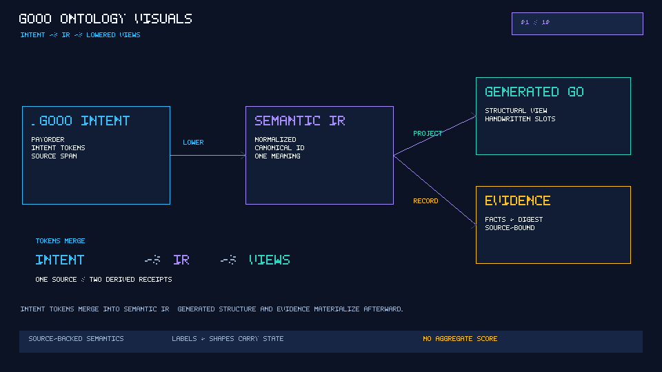
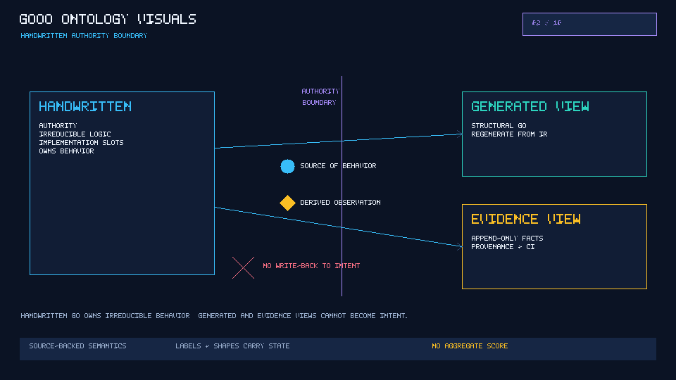
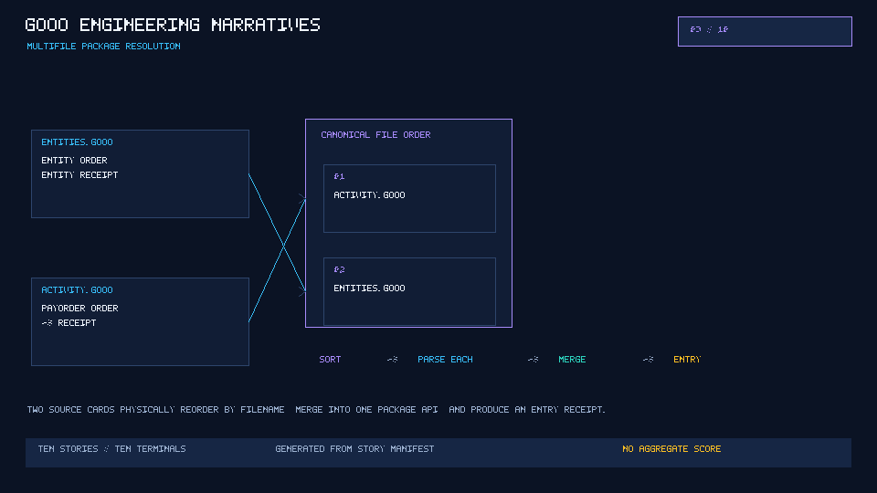
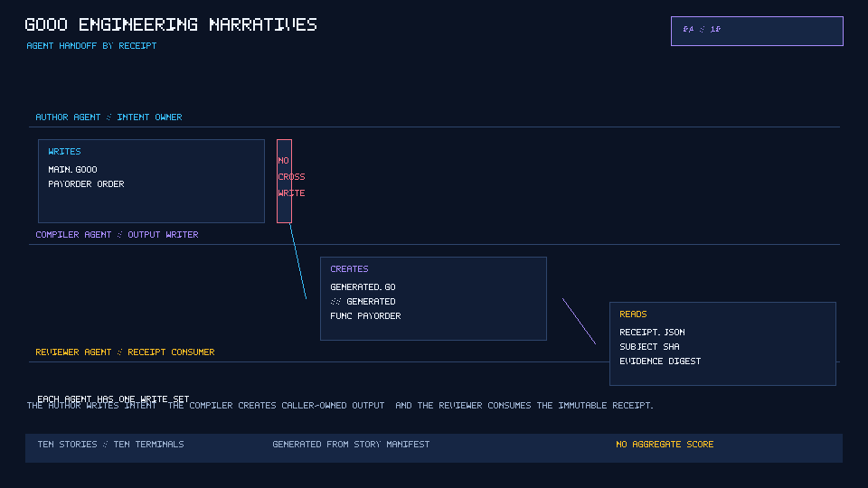
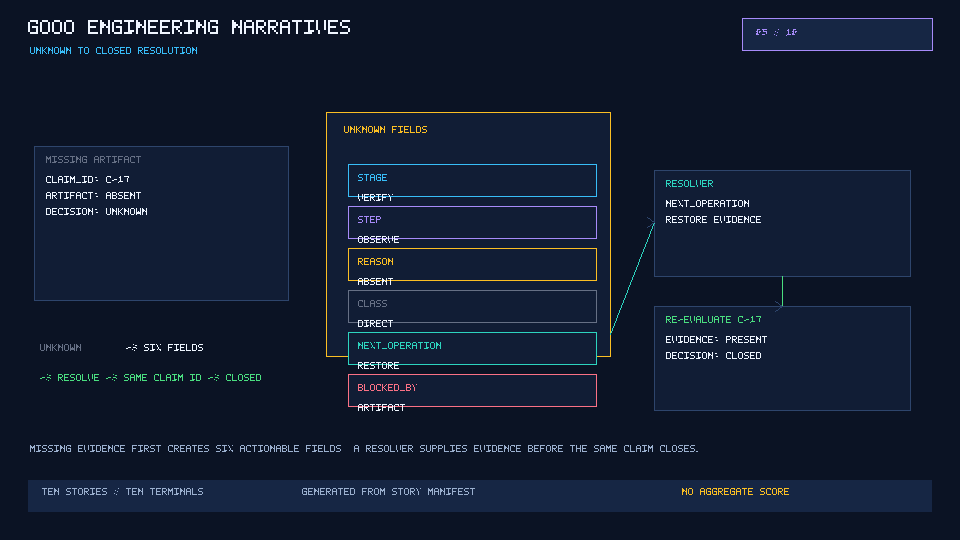
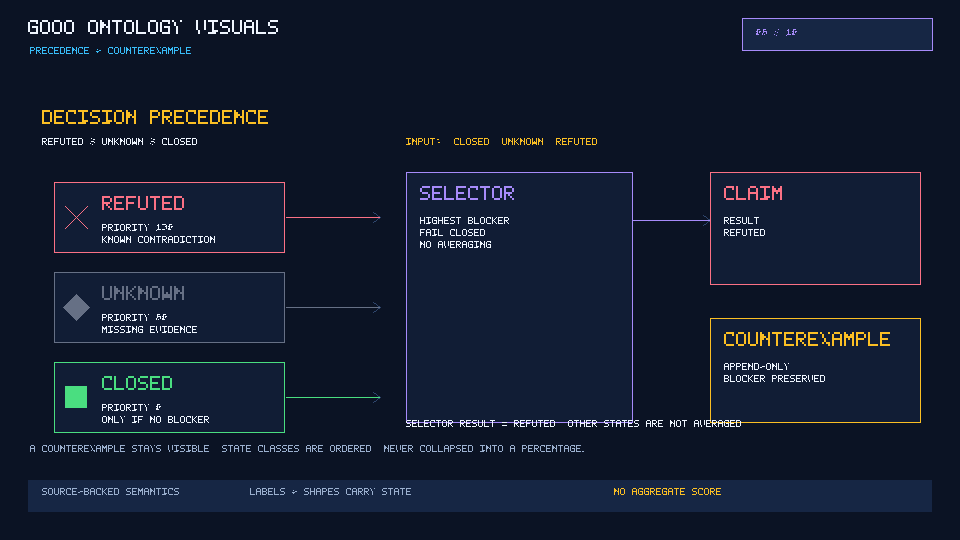
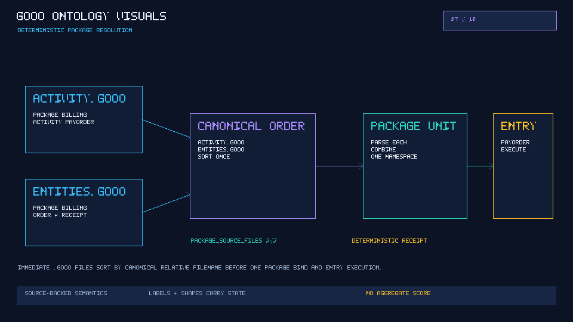
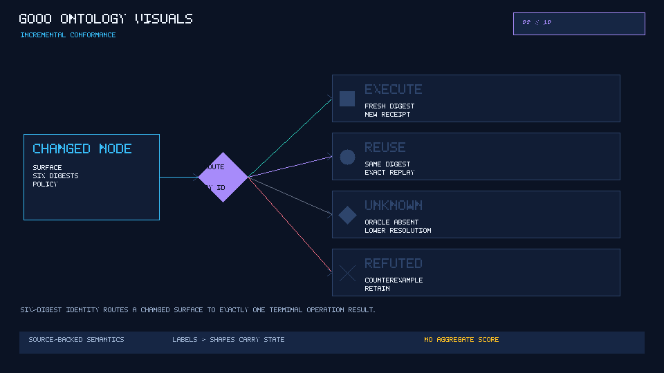
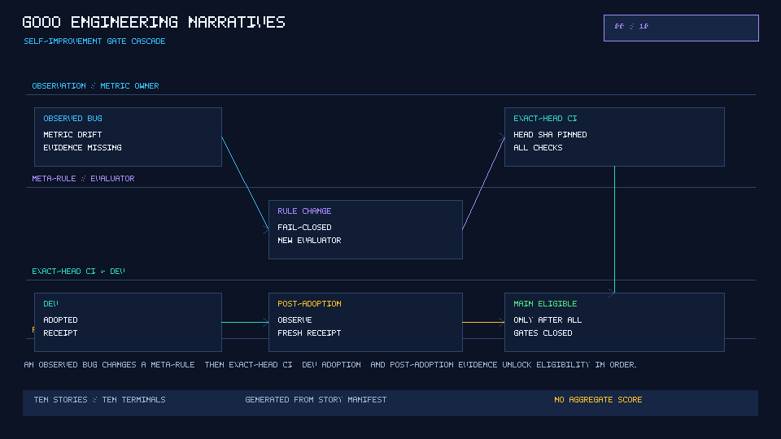
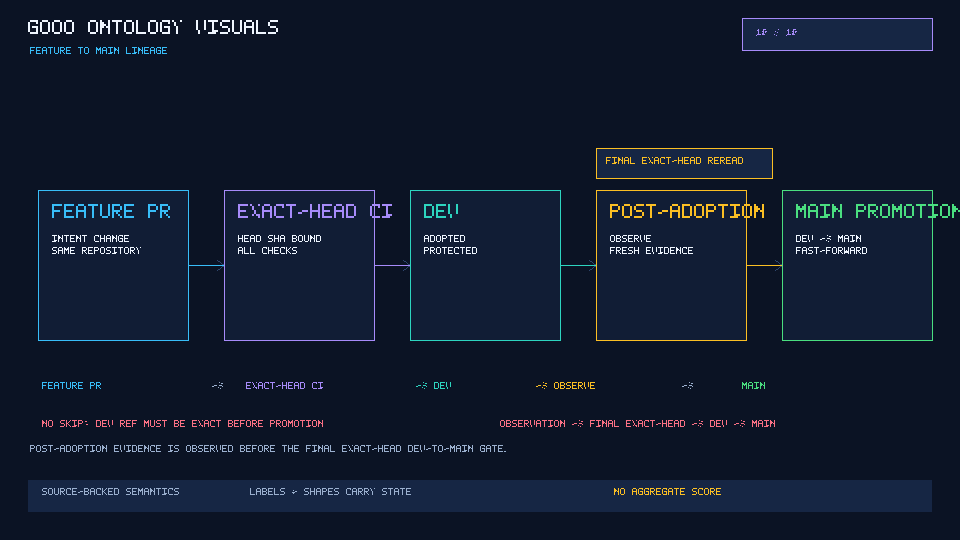

# meta-ontology-go

**Gooo — Go Of Ontology** is an experimental language for expressing intent,
assembling programs, and keeping the evidence of how they behave. This repository
contains its Go compiler. Source files use the `.gooo` extension.

Think of Gooo as a workshop: declarations provide the plan, a small local model
can suggest which permitted parts to assemble, and the compiler checks the fit
and generates Go. A Go experiment runner builds and executes the resulting
program. Each attempt leaves a receipt connecting intent,
choices, generated code, test results, and unresolved questions.

Business intent lives in Gooo declarations. The compiler lowers them to semantic
IR and projects structural Go. Handwritten Go slots hold implementation logic;
the experimental typed-path route can assemble bounded activity bodies from
conditions, assignments, references, branches, and expressions.

```text
Gooo source + intent + permitted choices + finite expectations
                         │
       optional local model → proposed path → finite tests
                                  ↑              │
                                  └── feedback ──┘
                                         │
                          selected source → Go → execution
                                         │
                         source-bound completeness receipts
```

**Start here:** [direction and current progress, 한국어](docs/language-direction.ko.md)
· [body generation](docs/language/body-codegen.md)
· [small model integration](docs/three-choice-path-model.md)
· [completeness observations](docs/declared-completeness-receipt.md).

## What we are developing

The goal is to make program construction an inspectable language operation.
Stable semantic IDs connect a declaration to its generated structure and observed
behavior. Small models guide finite choices inside those boundaries. When a model
is unavailable, the compiler continues through the declared deterministic route.

The current experiments use an independently trained **2,072-parameter shared
judge** for three binary decisions, giving eight complete body paths. It receives
source-derived context, Korean/English intent, candidate structure and, on later
attempts, actual failed-case feedback. Gooo owns the alternatives and the budget.
Broader natural-language discovery and reusable learned abstractions are the next
language research questions.

We want the language to carry the assembly plan and its unfinished obligations
along with the program. A useful improvement should complete more of the declared
behavior, spend fewer attempts or less memory, and keep the reason for each
change inspectable. Those are the comparisons we are building toward across
languages; the measurements below compare Gooo's own experimental variants.

| Part | Public home | What to find there |
| --- | --- | --- |
| Language and compiler | This repository | Gooo source, semantic IR, projection, execution and receipts |
| Local inference | [gooo-decision-runtime](https://github.com/kimjooyoon/gooo-decision-runtime) | Go model loaders, fixed workspaces, typed search and feedback |
| Research | [gooo-neural-decision-experiments](https://github.com/kimjooyoon/gooo-neural-decision-experiments) | Training, comparisons, raw evidence and reproduction tools |
| Model weights | [Hugging Face: shared Gooo judge](https://huggingface.co/asketeddy/gooo-shared-judgment-tiny-v1) | FP32 and ternary exports, model card and evidence bundles |

## Current observations — 2026-10-03

The latest model study and the deployed integration have separate evidence:

- **Full-input model research:** four freshly initialized shared judges completed
  6,400 local GPU updates. On 512 previously observed development views, the
  original FP32 control completed all 16 supplied expectations in **113/512**
  first choices; the whole-text fragment model completed **368/512 (71.88%)**.
  Extra ranked attempts fell **1,469 → 186**. Both Korean/English views chose
  valid paths in **180/256** pairs, while **68/256** pairs chose the same wrong
  path. All twelve FP32/PTQ/QAT exports are public.
  [Full comparison](https://github.com/kimjooyoon/gooo-neural-decision-experiments/blob/main/docs/full-input-judgment-initial-results-20261003.md).
- **Compact execution:** 96 generations made 298 local predictions and led to
  192 compiled runs. All **2,304 supplied finite expectations** passed; all
  **48 expanded/compact pairs** retained the same unseeded generated behavior.
  Compact prediction medians were **23.7–30.2 µs** and fresh-process codegen
  medians **27.8–29.5 ms** on local arm64 with Go 1.27.1. QAT's codegen median
  rose slightly. [Native study and resource scope](https://github.com/kimjooyoon/gooo-neural-decision-experiments/blob/main/docs/compact-shared-native-results-20261003.md).
- **What the new study exposed:** counting text fragments can lose operation
  order; wording augmentation and ternary conversion also produced regressions.
  On arm64 and Linux, all 18,432 first choices agreed, while **272 complete
  candidate rankings differed** under small numerical changes. The exact
  comparison failed on partial-completion curves. A subsequent versioned rounding
  rule now reproduces every intermediate value and full ranking on those 18,432
  pairs, with unchanged weights and first-path completeness. SDK extraction,
  remaining evaluations and native adoption of the new V4 models are next.
  [Paired arithmetic results and retained failure](https://github.com/kimjooyoon/gooo-neural-decision-experiments/blob/main/docs/full-input-separate-arithmetic-results-20261003.md).

The compiler currently uses **Go SDK v0.2.14-experimental** and the earlier V3
feature contract. The native timing/execution figures above belong to those
models. New V4 artifacts run in the research runtime; the
[model guide](docs/three-choice-path-model.md) identifies the compatible bundle.
The earlier [phrasing diagnosis](https://github.com/kimjooyoon/gooo-neural-decision-experiments/blob/main/docs/bilingual-wrapper-audit-results-20261003.md)
explains why the new study keeps the entire instruction while changing its
representation and training wording.

FP32 weights occupy **8,288 bytes**. Ternary weights occupy **446 bytes** on disk
and decode to **2,096 bytes** of tensors plus eight scale bytes; caller scratch
uses **3,200 bytes**. Whole-process RAM includes additional compiler/runtime
work. These experiments use authored finite tasks; broader workflow coverage and
bilingual meaning preservation need further measurement.

We measure completeness as several obligations: declared structure, generation,
finite behavior, reverse links, execution boundaries, and remaining unknowns.
For example, “368/512 complete” counts functions meeting every supplied example
on their first path. Partial example coverage, later search, and unresolved
execution obligations have their own counts, so one percentage stays tied to
the question it answers.
`gooo completeness-delta` compares two observations while retaining changed
scope, removed obligations, failures, and the first unresolved claim.
[Comparison contract and example](docs/completeness-delta.md).

## Ideas we build on

[SKETCH](https://people.csail.mit.edu/asolar/papers/asplos06-final.pdf) provides a
useful precedent for completing a partial program under a specification.
[DeepCoder](https://arxiv.org/abs/1611.01989) shows how learned program properties
can guide a search; this helps frame our small model's role in choosing attempts.
[DreamCoder](https://arxiv.org/abs/2006.08381) connects program search, neural
guidance and the growth of reusable abstractions.
[Laya](https://huggingface.co/convaiinnovations/laya) helped frame our early
experiments around structured decisions; the current tiny models start from our
own initialization and Gooo training data.
[BitNet b1.58](https://arxiv.org/abs/2402.17764) motivates studying ternary weights,
with storage, runtime memory and quality measured separately.
[W3C PROV-O](https://www.w3.org/TR/prov-o/) supplies vocabulary for tracing the
entities, activities and agents behind an artifact. Our combination of these
ideas is developed through the public experiments linked above.

<!-- PUBLIC-TRUST-BADGES:BEGIN -->
### Public trust surface

These badges are generated from the lowered public-trust `.gooo` policy. Workflow badges report workflow results; they do not claim branch-protection or ruleset enforcement.

#### Language / Release

[](https://github.com/kimjooyoon/meta-ontology-go/blob/dev/go.mod)
[](https://github.com/kimjooyoon/meta-ontology-go/releases/tag/v0.6.0-dev)

#### Build / Conformance

[](https://github.com/kimjooyoon/meta-ontology-go/actions/workflows/ci.yml)
[](https://github.com/kimjooyoon/meta-ontology-go/actions/workflows/self-improvement-compiler-compatibility.yml)
[](https://github.com/kimjooyoon/meta-ontology-go/actions/workflows/gooo-release-readiness.yml)

#### Security / Supply Chain

[](https://github.com/kimjooyoon/meta-ontology-go/security/code-scanning)
[](https://github.com/kimjooyoon/meta-ontology-go/blob/dev/.github/dependabot.yml)
[](https://github.com/kimjooyoon/meta-ontology-go/actions/workflows/dependency-review.yml)
[](https://github.com/kimjooyoon/meta-ontology-go/security/advisories/new)

#### Evidence / Project Health

[](https://github.com/kimjooyoon/meta-ontology-go#project-status)

#### Community

[](https://github.com/kimjooyoon/meta-ontology-go/blob/dev/LICENSE)

The complete row ledger, including unavailable and refuted claims, is emitted by the `Public trust surface` workflow.
<!-- PUBLIC-TRUST-BADGES:END -->

The core language covers packages, namespaces, stable entity IDs and activities.
Experimental profiles add entity fields, typed body construction and Gooo-owned
receipt structures. [The language sketch](docs/spec.md) describes the core;
[body generation](docs/language/body-codegen.md) and
[receipt projection](docs/declared-completeness-receipt.md) describe those profiles.

## Earlier design illustrations

The following illustrations explain design ideas. Current implemented behavior
and measured results are described in the sections above and their linked studies.

### The deterministic pressure loop

[](docs/assets/metric-pressure-loop/metric-pressure-loop.png)

The [static PNG preview](docs/assets/metric-pressure-loop/metric-pressure-loop.png)
is useful in viewers that do not animate GIFs. The loop is illustrative: each
system's protected policy/SPI declares its own `N` base metrics, `M` cross
pressures, and active `K`; the language guarantees at least **two independent,
non-compensating pressure dimensions**, not one universal set of numbers. The
animation uses `N=6`, `M=4`, and `K=2` only as one concrete policy instance, and
the 100 parallel agents are an illustrative workload. Every agent focuses only
on the selected subset while all `N` baseline metrics remain non-regression
floors. A performance gain that damages completeness, or the reverse, is
rejected. Attempts may use local inference and may PASS, FAIL, or remain
UNKNOWN, but missing evaluator/oracle/evidence is fail-closed: **Deterministic
CI — not inference** checks exact source-backed evidence across the full
declared vector. Proof computes remaining viable paths, and only a qualified
ceiling becomes the next immutable floor with the next metric/SPI and
provenance obligations. Self-improvement here means verified contract,
evaluator, and evidence gains compound; agents do not rewrite the judge or
lower thresholds.

## The ontology in motion

These ten deterministic GIFs are one visual denominator, generated by the shared
renderer in [`docs/assets/ontology-visuals`](docs/assets/ontology-visuals) and
bound to the source concepts listed in [`visual-manifest.json`](docs/assets/ontology-visuals/visual-manifest.json).
They use labels and shapes as well as color, so CLOSED, UNKNOWN, and REFUTED are
not color-only states. The exact checked-in asset count, byte total, and SHA-256
digests are recorded in [`generated-asset-lock.json`](docs/assets/ontology-visuals/generated-asset-lock.json).

<table>
<tr>
<td width="50%"><br><strong>1. Source to generated Go</strong><br>A billing declaration becomes generated Go plus a receipt.</td>
<td width="50%"><br><strong>2. Semantic IR as graph</strong><br>A typed graph is consumed by the backend.</td>
</tr>
<tr>
<td><br><strong>3. Multifile package resolution</strong><br>Unordered source files become a deterministic package API.</td>
<td><br><strong>4. Agent handoff by receipt</strong><br>Author, compiler, and reviewer agents exchange caller-owned artifacts.</td>
</tr>
<tr>
<td><br><strong>5. UNKNOWN to CLOSED resolution</strong><br>Six fields guide a resolver to a new evidence-backed decision.</td>
<td><br><strong>6. Refutation precedence</strong><br>A known contradiction wins and remains in the ledger.</td>
</tr>
<tr>
<td><br><strong>7. Deterministic replay block</strong><br>Byte drift blocks adoption after replay comparison.</td>
<td><br><strong>8. Incremental conformance router</strong><br>One identity selects one reused receipt.</td>
</tr>
<tr>
<td><br><strong>9. Self-improvement gate cascade</strong><br>Each receipt unlocks the next engineering gate.</td>
<td><br><strong>10. Experimental domain projection</strong><br>Proposed cross-domain projection remains UNKNOWN until implemented evidence exists.</td>
</tr>
</table>

Regenerate the complete set with `go run ./docs/assets/ontology-visuals`.

Regenerate and verify the checked-in media with:

```sh
go run ./docs/assets/metric-pressure-loop
go run ./docs/assets/metric-pressure-loop -check
```

## Quick start

Run the repository checks from the project root:

```sh
gofmt -l .
go test ./...
go vet ./...
go run ./cmd/gooo check examples/billing/main.gooo
```

The conformance walkthrough in [docs/conformance.md](docs/conformance.md) uses
the checked-in examples and shows the expected command shapes. It also calls out
which CLI surfaces are not yet supported. The current GitHub Actions workflow is
documented in [CONTRIBUTING.md](CONTRIBUTING.md); it should be treated as the
source of truth for required CI, not as a promise of future compiler features.

## Branch and promotion contract

Work branches target `dev`. Promotion uses a same-repository pull request to
`main`. CI accepts either the exact `dev` head when it is a fast-forward, or a
single-commit snapshot branch named `agent/main-promotion-snapshot-<dev-sha>`
whose tree equals the live `dev` tree and whose sole parent is the live `main`
head. The snapshot form preserves the current tree and main's linear history
when old branch ancestry has diverged. Governance is `ci_only`: review and
approval fields do not authorize a protected-branch promotion.

The six canonical proof jobs are `gofmt`, `go vet`, `go test`, `go test -race`,
`Semantic conformance`, and `CI policy`. GitHub's `main` protection rule now
requires exactly these six contexts; the retired `CI guardian` context was
removed. The `dev` rule has no required status checks. No badge above turns a
workflow result into an enforcement claim.

The repository's default branch is `dev`; checked changes are also promoted to
protected `main` through this process. The separate protection update removed
the retired Guardian check.

For either promotion form, CI emits a digest-bound `promotion_authorization`
with `source=dev`, `target=main`, and `operation=fast_forward`. It passes only
for fresh exact refs and topology (`ahead > 0`, `behind = 0`, `main` as merge
base), the six canonical proof jobs, and a clean, open, non-draft, unmerged
same-repository pull request. Snapshot evidence also binds the live `dev` SHA
and tree, candidate tree, and candidate's sole `main` parent. The proof producer
never mutates refs or protection. After a final exact reread, only a normal
fast-forward update is allowed; force updates are prohibited.

## Project status

The language and its model interfaces are experimental. Runnable commands and
their linked evidence define current support. Production editor integration,
broader analysis, automatic reconciliation of ambiguous observations and durable
provenance publishing remain development areas. Historical protocols retain the
scope and outcomes of the revision they measured.

## Governance

[AGENTS.md](AGENTS.md) defines authority boundaries and agent roles.
[CONTRIBUTING.md](CONTRIBUTING.md) defines branch, PR, review, and CI workflow.
[docs/governance.md](docs/governance.md) records the SSOT boundary, BX laws, line
caps, and evidence policy. [docs/metrics-rfc.md](docs/metrics-rfc.md) defines
the design-only deterministic metric contract. [docs/conformance.md](docs/conformance.md)
is the runnable example index. The [Deterministic CI Evolution Retrospective](docs/deterministic-ci-evolution.md)
is the append-only read-only evidence record.

An experimental source-to-Go activity-body projection is documented at
[docs/language/body-codegen.md](docs/language/body-codegen.md). It keeps body
generation separate from the stable package projection until its syntax and
completeness claims have broader evidence.

The completeness receipt's shared structure is declared in Gooo and generates
the compiler's Go types and JSON Schema. See
[declared completeness receipt](docs/declared-completeness-receipt.md) for the
bounded projection profile, source binding and independent consumption checks.

[W3C PROV-O]: https://www.w3.org/TR/prov-o/
