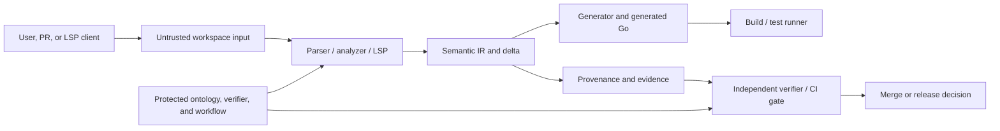

# Security threat model and CI security gates

Status: design research for the compiler, LSP, generator, and verification loop.
This document proposes controls; it does not change the implementation or make a
future control true merely by documenting it.

## Security objective

The security boundary is the path from authoritative `.gooo` intent to a generated
Go projection and its evidence. An attacker must not be able to turn a workspace
input, an editor request, a generated file, or a provenance record into:

- a read or write outside the authorized workspace/output roots;
- execution of an attacker-selected command, hook, or executable;
- silent replacement of source, handwritten logic, or unrelated generated output;
- a false semantic identity, scope approval, freshness claim, or evidence chain; or
- unbounded CPU, memory, file-descriptor, process, or disk consumption.

The intended security property is therefore:

```text
untrusted input
    -> bounded parse/analyze
    -> source-backed semantic delta
    -> independently checked projection
    -> append-only, hash-bound evidence
    -> least-privilege build artifact
```

This is a compiler security problem as well as a supply-chain problem. Generated Go
is executable output, but the compiler also reads and writes files, starts tools,
serves an LSP protocol, and makes semantic/provenance decisions that CI may use for
authorization.

## System and trust boundaries



### Trusted or protected

- The operating system, Go runtime, repository rules, and the isolated CI runner.
- Maintainer-controlled ontology vocabulary, semantic identity rules, verifier
  semantics, CI policy, and workflow definitions.
- The independent gate that checks semantic scope, generated integrity, freshness,
  and evidence. No Builder should be able to change and approve this gate.

### Untrusted or attacker-influenced

- `.gooo`, Go, generated-output, workspace configuration, file names, symlinks, and
  contents in a checkout, including a pull request from a fork.
- LSP messages, document URIs, workspace folders, cancellation behavior, and client
  capabilities.
- Semantic names, aliases, asserted relations, source spans, hashes, timestamps,
  evidence payloads, and any data copied from generated output.
- Environment variables, PATH entries, Git refs, command arguments, and tool output
  derived from a workspace or PR event.

### Assumptions and non-goals

This model assumes the host kernel and the protected GitHub/repository account are not
already compromised. It does not attempt to defend against a user who intentionally
grants the compiler full local-machine privileges, or against a maintainer-approved
change to the protected kernel. Those are separate operational controls. It does
cover a malicious project, malicious PR author, compromised LSP client, stale cache,
and a compromised or misleading generated projection.

## Assets and impact

| Asset | Security property | Impact if compromised |
| --- | --- | --- |
| `.gooo` and handwritten Go | Integrity and locality | Wrong business behavior, source loss, or unauthorized semantic change |
| Semantic IDs and IR | Identity, namespace isolation, consistency | Scope bypass, confused-deputy relations, incorrect generated code |
| Generated Go and source maps | Determinism and correspondence | Backdoor, build drift, or reviewable source no longer matching output |
| Provenance/evidence | Authenticity, freshness, append-only history | False claim that an artifact was reviewed, tested, or generated from trusted input |
| Workspace and runner files | Confidentiality and containment | Secret/source disclosure, overwrite of repository or host files |
| CPU, memory, processes, descriptors, and disk | Availability | LSP/CI denial of service and runner starvation |
| CI credentials and tokens | Confidentiality and least privilege | Repository takeover, artifact tampering, or secret exfiltration |

## Threat register

Severity is the expected consequence after a plausible exploit, not a statement that
the current skeleton already contains the full vulnerable implementation.

| ID | Threat and abuse path | Primary assets | Severity | Required security property |
| --- | --- | --- | --- | --- |
| T1 | Path traversal or symlink escape in input, cache, source-map, or `--out` path | Workspace, source, runner | High | Every filesystem operation is contained by an authorized root after canonicalization and symlink checks |
| T2 | Arbitrary command through shell interpolation, executable lookup, hooks, or PR-controlled arguments | Runner, tokens, repository | Critical | Only fixed, allowlisted programs with argv separation, scrubbed environment, timeout, and no shell are executable |
| T3 | Generated-file overwrite through collision, forged marker, symlink, or partial write | Source, handwritten logic, generated output | High | Generation is fail-closed, atomic, provenance-bound, and refuses non-generated or ambiguous targets |
| T4 | Provenance spoofing through forged IDs, source spans, hashes, evidence, or replayed receipts | IR, evidence, merge decision | Critical | Evidence is source-bound, append-only, fresh, canonicalized, and independently verified |
| T5 | Untrusted workspace or PR code reaches privileged CI, secrets, network, hooks, or the verifier itself | Runner, tokens, verifier policy | Critical | Untrusted code runs with read-only, no-secret, isolated privileges; protected checks run from trusted code |
| T6 | Resource exhaustion through parser depth, graph fan-out, LSP floods, generated explosion, cache churn, or child-process output | CI/LSP availability | High | Explicit budgets, cancellation, bounded queues/output, quotas, and deterministic rejection |
| T7 | Semantic namespace confusion or identity collision caused by display names/aliases | IR, generated code, scope | High | Stable absolute IDs and namespaces are canonical identity; names never authorize a relation |
| T8 | Stale or cross-build cache/evidence is accepted as current | Generated output, evidence | High | Cache keys and evidence bind source, policy, toolchain, options, and revision; freshness is checked before use |

T1–T6 are the requested primary threats. T7 and T8 are included because they turn a
successful filesystem or CI attack into a semantic authorization bypass.

## Threat analysis and controls

### T1 — Path traversal, symlink escape, and path confusion

Relevant inputs include source URIs received by LSP, `--out` and cache directories,
generated file names derived from IDs or names, source-map paths, workspace roots, and
Git paths. `filepath.Clean` alone is insufficient: it does not establish that a path
stays below a root when symlinks, junctions/reparse points, absolute paths, alternate
separators, or a time-of-check/time-of-use race are involved. This is the class
described by [CWE-22](https://cwe.mitre.org/data/definitions/22.html).

Required design rules:

1. Treat a workspace root and an output root as capabilities, not as strings supplied
   by the document. Reject NUL bytes, empty/ambiguous roots, absolute paths, drive or
   UNC paths where they are not explicitly supported, and components that resolve to
   `..`.
2. For every derived target, canonicalize the root and candidate, require the
   candidate to be a descendant of the root using a component-aware comparison, and
   reject symlinks/junctions/reparse points in the path. Re-check at open/rename time
   to reduce TOCTOU exposure; prefer no-follow or directory-handle primitives where
   the platform supports them.
3. Generate file names from a constrained, deterministic mapping of stable semantic
   IDs. Do not concatenate a display name, alias, user-provided path, or URI directly
   into a filesystem path. A path map must reject collisions after normalization.
4. Keep caches and temporary files below an ephemeral, per-invocation directory. Do
   not follow symlinks from a cache entry, and do not treat cache contents as trusted
   input without checking the content digest and schema version.
5. Restrict LSP `file:` URIs to registered workspace roots. A client request must not
   make the server read arbitrary local files, and a workspace folder must not widen
   the root without an explicit trusted configuration decision.

CI tests should exercise `../`, absolute, drive/UNC, separator-mixed, Unicode-normalized,
symlinked, and pre-existing target paths. Tests must verify both read and write
   behavior and must leave no file outside a temporary root.

### T2 — Arbitrary command execution

The current verifier uses `os/exec` with a fixed `git` command and separate arguments,
which is safer than interpolating a shell command. The Go `os/exec` package does not
invoke a shell by default, but it still runs a real process with inherited working
directory and environment unless the caller constrains them. Future compiler features
must not turn a DSL field, semantic name, LSP message, Git ref, workspace config, or
generated string into a program name or shell fragment.

Required design rules:

- Never use `sh -c`, `bash -c`, `cmd.exe /c`, or equivalent composition for workspace
  data. Use `exec.CommandContext` with a fixed executable and an argv list. Validate
  Git revisions as full object IDs or an allowlisted ref grammar, and terminate option
  parsing with `--` wherever the invoked tool supports it.
- Prefer an absolute, configured tool path or a verified toolchain directory over a
  mutable PATH. Reject `ErrDot` and executables found in the workspace. Do not execute
  files produced by the project, including generated Go, scripts, hooks, or binaries,
  during parse, LSP, or verification stages.
- Build an allowlist of commands required by each stage. A command not on the stage's
  allowlist is a policy failure, not a best-effort fallback. The generator itself
  should not need a command runner.
- Set a minimal environment, safe working directory, closed standard input, bounded
  stdout/stderr, and a context deadline. Use a process-group strategy where supported
  so cancellation also handles descendants. Record command identity and exit status,
  but never record secret-bearing environment values.
- Disable repository hooks and user/global Git configuration for CI operations. Do not
  pass secrets to jobs that inspect untrusted source. Network access should be denied
  by default for parse, generate, analyze, and LSP jobs.

The security test suite should poison PATH, include shell metacharacters in every
string-shaped input, use a fake executable in the workspace, provide a hanging child,
and emit more output than the configured limit. A passing test must demonstrate that
no unexpected process starts and that cancellation returns within the budget.

### T3 — Generated-file overwrite and locality failure

Generated markers are useful for locality but are not an authorization mechanism:
attacker-controlled text can contain plausible markers. A generator that blindly
opens `out/name.go`, replaces the first marker pair, or follows a symlink can destroy
handwritten logic or overwrite an unrelated file.

Required generation contract:

1. Resolve and authorize the output root before planning files. Produce a complete,
   deterministic plan in memory: target path, expected generated-region hash, source
   semantic IDs, and output digest. Abort before writing if any target is outside the
   root, collides after normalization, or exceeds file/count/byte budgets.
2. If a target does not exist, create it only under the authorized root. If it exists,
   require a valid, unique generated-region structure and a matching prior provenance
   record. Refuse to overwrite a non-generated file, malformed marker pair, duplicate
   marker, symlink, or file whose handwritten slot cannot be preserved exactly.
3. Write a temporary file in the same authorized directory, apply restrictive mode,
   flush and close it, verify the digest and formatting, then atomically rename it.
   Never truncate the destination before all checks pass. On failure, leave the prior
   file unchanged and clean up only the invocation's temporary files.
4. Generated output must include stable semantic IDs and source-map links, but those
   links are checked against the current DSL/IR. Output text alone cannot authorize a
   new relation or overwrite.
5. A freshness gate must run generation twice from identical inputs and compare bytes,
   markers, source maps, and file manifests. A locality test must prove that changing
   one semantic subgraph does not rewrite unrelated regions or handwritten slots.

### T4 — Provenance spoofing and false evidence

The project treats `.gooo` as authoritative for business intent, semantic IDs as
identity, and provenance/evidence as append-only records. This distinction is a
security boundary. A generated comment, Go symbol name, user assertion, or evidence
payload must not be able to promote itself into authoritative intent merely because it
looks canonical.

Required evidence rules:

- Canonicalize and validate absolute IDs, namespaces, relation vocabulary, source
  spans, and hashes before storing them. Reject duplicate IDs, namespace confusion,
  invalid spans, ambiguous aliases, and an ID whose meaning changes when its display
  name changes.
- Classify observations as syntactic, deterministic, or candidate. Only a
  source-backed deterministic fact with a valid span and matching input digest may
  update the IR. Candidate facts remain reviewable evidence and cannot authorize
  scope, merge, release, or capability use.
- Bind every receipt to the exact source bytes or commit, DSL/IR fingerprint,
  generator/verifier identity, policy version, toolchain, options, dependency lock,
  runner identity, and output digest. A receipt for a prior HEAD, different policy,
  or different generator is stale, even if its text is identical.
- Keep evidence append-only and linked to the activity that produced and verified it.
  Do not allow an input file to claim that it was verified by copying a `verified`
  field from generated output. The independent verifier must recompute the claim from
  source, output, and evidence digests.
- Require freshness and anti-replay checks: current revision, expected parent/build
  context, unique invocation identity, and non-reuse of a receipt across incompatible
  inputs. Signatures or attestations are useful only after their subject digest and
  signer trust policy are independently checked.

The intended model aligns with [W3C PROV-O](https://www.w3.org/TR/prov-o/): an
`Entity`, `Activity`, and `Agent` describe what was used, produced, and associated,
but a PROV-shaped record is not automatically proof. A proof is a validated,
source-bound provenance path satisfying the protected claim and policy.

### T5 — Untrusted workspace and CI execution

An untrusted checkout is data for the compiler and potentially code for the Go build;
it must not receive the privileges of the verifier or release job. The current
workflow is a good baseline in two respects: it uses `pull_request`, declares
`contents: read`, and does not provide secrets to the shown jobs. It still checks out
PR content and executes repository-controlled Go, and its action references are tags
(`actions/checkout@v4`, `actions/setup-go@v5`) rather than immutable commit SHAs.

The most important gap is verifier self-modification: a PR can change files under the
currently allowed `scripts/**` or `internal/verify/**` scope and then have the policy
job execute the changed verifier. A check that the candidate can rewrite is not an
independent gate. Path scope alone cannot solve this because the policy implementation
is itself in the candidate tree.

Required CI rules:

- Use untrusted `pull_request` jobs for parse, test, generate, and static checks with
  no secrets, read-only token, ephemeral runner, restricted network, and no artifact
  or cache reuse that can write into a trusted job's namespace. Never check out an
  untrusted PR in a privileged `pull_request_target` or `workflow_run` job.
- Run the protected verifier, branch policy, ontology policy, and security checks from
  the trusted base revision or a protected reusable workflow. Compare protected files
  against the base and require designated maintainers for changes to them. Do not let
  the candidate select the verifier, policy version, or required checks.
- Pin third-party actions to full commit SHAs, explicitly declare minimal permissions,
  restrict allowed actions, and keep workflow expressions out of shell source. GitHub
  documents branch names, PR titles, bodies, and similar context values as untrusted
  input for script-injection purposes; pass them as environment data only after
  validation, never by interpolation into a command.
- Separate Builder, Guardian, and Gate roles. The author of a feature or evidence
  record must not be the sole approver of its semantic scope or provenance. A draft PR
  targeting `integration` remains subject to the trusted gate before merge.
- Treat uploaded artifacts, caches, generated files, and test reports from an
  untrusted job as untrusted inputs. Verify their digest and schema in a fresh job;
  never execute them or restore them into a privileged workspace.

These controls follow GitHub's [script-injection guidance](https://docs.github.com/en/actions/concepts/security/script-injections),
[secure-use guidance](https://docs.github.com/en/actions/reference/security/secure-use),
and [workflow execution protections](https://docs.github.com/en/repositories/managing-your-repositorys-settings-and-features/actions-policies/workflow-execution-protections).

### T6 — Resource exhaustion and denial of service

The compiler and LSP must assume hostile size and shape, not only hostile syntax.
Examples include deeply nested expressions, a declaration/fact fan-out that creates a
quadratic closure, repeated identical LSP requests, huge diagnostics, generated-file
explosion, cache-key cardinality, a child process that never closes output, and a
client that opens many documents concurrently.

Every stage needs a budget with deterministic failure and cancellation. Initial values
below are starting policy candidates, to be measured against real projects before
being made compatibility commitments:

| Budget | Initial ceiling | Failure behavior |
| --- | ---: | --- |
| One source document | 8 MiB | Reject before full parse |
| One LSP message | 1 MiB | Close or reject the request |
| Tokens / AST nodes per document | 1,000,000 / 2,000,000 | Return bounded diagnostic |
| Nesting / recursive query depth | 256 / 256 | Stop with a limit diagnostic |
| Declarations / semantic facts | 100,000 / 1,000,000 | Abort lowering or closure |
| Generated files / bytes per invocation | 10,000 / 256 MiB | Abort before writes |
| LSP request CPU / wall time | 2 s / 5 s | Cancel and preserve prior result |
| Child-process wall time / output | 60 s / 16 MiB | Kill, close pipes, record failure |
| Cache bytes / entries per workspace | 1 GiB / 100,000 | Evict only reconstructable entries |

Implementation requirements:

- Enforce limits while reading, tokenizing, lowering, serializing, and emitting; a
  final length check is too late. Prefer streaming decoders and bounded readers over
  unbounded `io.ReadAll` on workspace or tool output.
- Propagate `context.Context` cancellation through parser, analyzer, graph queries,
  generator, and subprocesses. Bound LSP concurrency and queue depth; coalesce or
  drop superseded diagnostics for the same document.
- Use iterative or depth-limited algorithms for attacker-controlled nesting. Bound
  transitive closure and inverse/derived relation materialization; never assume graph
  monotonicity makes a query finite.
- Reserve disk space by plan, write atomically, and enforce per-workspace quotas.
  Cache eviction must not delete authoritative source or append-only evidence.
- Add adversarial benchmark tests and run them with the race detector where shared
  state is involved. The test must assert a bounded result, not merely eventual
  completion on a healthy machine.

### T7/T8 — Identity confusion and stale projection/cache

Stable IDs are URI-like semantic identity; display names and aliases are not. The
compiler must reject a duplicate ID in different declarations unless the semantics
explicitly define one canonical owner. A relation must resolve through the namespace
and registered identity, not by matching a Go or DSL string. This prevents a benign
`Payment` in one context from being confused with another.

Every reconstructable projection and cache entry should be keyed by at least:

```text
schema/version + source digest + semantic IR digest + generator/verifier digest
              + policy digest + toolchain/dependency digest + options digest
```

On any mismatch, recompute. Cache hits are optimization evidence, not authority. A
stale semantic graph, source map, generated file, or receipt must fail freshness rather
than silently becoming the current view.

## CI security gate proposal

The existing CI checks (`gofmt`, `go vet`, unit tests, race tests, semantic
conformance, generated freshness, Go caps, changed-path scope, and
`agent/*` → `integration` branch policy) remain required. Add the following gates as
the corresponding compiler surfaces become available.

| Gate | What it proves | Required checks | Failure policy |
| --- | --- | --- | --- |
| G0 Trusted policy | Candidate cannot redefine the gate | Run verifier/security policy from protected base; protected-file diff and CODEOWNERS/required review | Block merge; no candidate override |
| G1 Filesystem containment | Reads/writes stay in authorized roots | Traversal, symlink, junction, collision, URI, atomic-write, and cleanup tests | Fail closed; preserve prior files |
| G2 Command boundary | No arbitrary execution | Static call-site audit; fixed executable allowlist; argv-only; PATH/env/hook tests; timeout/output tests | Block any shell or unapproved command |
| G3 Generator locality | Output is deterministic and non-destructive | Two-run byte equality, marker integrity, source-map digest, handwritten-slot preservation, overwrite refusal | Abort before write |
| G4 Provenance integrity | Claims are source-backed and fresh | Canonical IDs, valid spans, input/output hashes, candidate quarantine, stale/replay receipts, independent recomputation | Reject evidence and semantic delta |
| G5 Untrusted CI | PR content cannot access trust or secrets | `pull_request`, read-only permissions, no secrets/network by default, SHA-pinned actions, no privileged checkout | Cancel job or require maintainer path |
| G6 Resource budgets | Hostile inputs terminate within limits | Size/depth/fan-out/LSP/concurrency/cache/subprocess tests and bounded diagnostics | Deterministic limit error |
| G7 Supply-chain receipt | Artifact provenance is reviewable | Reproducible inputs, toolchain/dependency digest, signed or otherwise authenticated build receipt | Do not publish or merge artifact |
| G8 Role separation | No one actor closes the loop | Independent Guardian/Gate review and required checks on protected policy/ontology | Require second role/approval |

### Minimum security test corpus

Before the compiler is exposed to untrusted workspaces, add fixtures for:

- path traversal, absolute/drive/UNC paths, separator confusion, NUL, Unicode
  normalization, symlinked roots/targets, generated-name collisions, and interrupted
  atomic writes;
- shell metacharacters, PATH poisoning, workspace-local executables, invalid Git refs,
  inherited secret variables, hanging commands, descendant processes, and oversized
  stdout/stderr;
- duplicate or renamed IDs, cross-namespace references, missing/forged source spans,
  candidate facts presented as deterministic, changed input bytes with old evidence,
  mismatched generator/policy digests, and replayed receipts;
- deeply nested input, graph fan-out, large diagnostics, repeated/cancelled LSP
  requests, generated output fan-out, cache quota exhaustion, and concurrent access;
- a PR that edits `scripts/verify/**`, `internal/verify/**`, ontology files, or the
  workflow while leaving application code unchanged. The trusted-base gate must still
  detect and route this as a protected-kernel change.

Each fixture should assert the security invariant and the absence of side effects,
not just an error string. Tests that intentionally execute a child process belong in
an isolated subprocess test with no secrets and an explicit timeout.

## Rollout and evidence

1. **Now:** keep this document as the security contract; retain read-only `pull_request`
   permissions and the existing deterministic checks; record the verifier
   self-modification gap as a blocking design item before security-sensitive merges.
2. **Before parser/generator release:** implement G1–G4 and G6 with malicious fixtures,
   deterministic limits, and evidence that includes source/output/policy digests.
3. **Before LSP release:** enforce URI/workspace containment, request budgets,
   cancellation, bounded diagnostics, and no execute-command capability by default.
4. **Before CI can authorize merge/release:** implement G0, G5, G7, and G8 with
   protected workflows, immutable action references, least-privilege tokens, and
   independent verification of receipts.

An evidence record for a successful gate should identify: the protected policy
revision, candidate revision, input and output digests, generator/verifier digests,
limits used, command allowlist, test corpus version, result, and the independent
verifier identity. These records are evidence of a decision; they do not become new
business intent.

## References

- [CWE-22: Improper Limitation of a Pathname to a Restricted Directory](https://cwe.mitre.org/data/definitions/22.html)
- [Go `os/exec` package](https://pkg.go.dev/os/exec) and [Go `path/filepath` package](https://pkg.go.dev/path/filepath)
- [W3C PROV-O](https://www.w3.org/TR/prov-o/)
- GitHub Actions [script injections](https://docs.github.com/en/actions/concepts/security/script-injections),
  [secure use](https://docs.github.com/en/actions/reference/security/secure-use), and
  [workflow execution protections](https://docs.github.com/en/repositories/managing-your-repositorys-settings-and-features/actions-policies/workflow-execution-protections)
- [SLSA security levels](https://slsa.dev/spec/v1.0/levels) and [in-toto](https://in-toto.io/)
